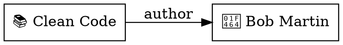

Exports the vault's object relation graph in [DOT format](https://graphviz.org/doc/info/lang.html). Nodes represent objects, edges represent relations and wiki-links. Output goes to stdout for piping to Graphviz or other visualization tools.

## Basic usage

```bash
tmd graph
```

Outputs a DOT digraph with all objects as nodes and all relations and wiki-links as edges.

### Example output



### Render with Graphviz

```bash
tmd graph | dot -Tpng -o graph.png
tmd graph | dot -Tsvg -o graph.svg
```

## Filter by type

```bash
tmd graph --type book
tmd graph --type book --type person
```

Only includes objects of the specified types. Edges are included only when both endpoints are in the filtered set. The `--type` flag can be repeated.

## Control edge types

```bash
tmd graph --no-wikilinks    # Relations only
tmd graph --no-relations    # Wiki-links only
tmd graph --no-relations --no-wikilinks  # Nodes only
```

Relation edges are drawn as solid lines with the property name as label. Wiki-link edges are drawn as dashed lines labeled "wikilink".

## Edge behavior

- **Relations**: Directed edges from source to target, labeled with the relation property name. Bidirectional relations produce one edge per stored direction (e.g., `author` and `books`).
- **Wiki-links**: Directed dashed edges from the linking object to the target. Unresolved wiki-links (broken targets) are skipped.
- **Deduplication**: Edges with the same source, target, and label are deduplicated.
