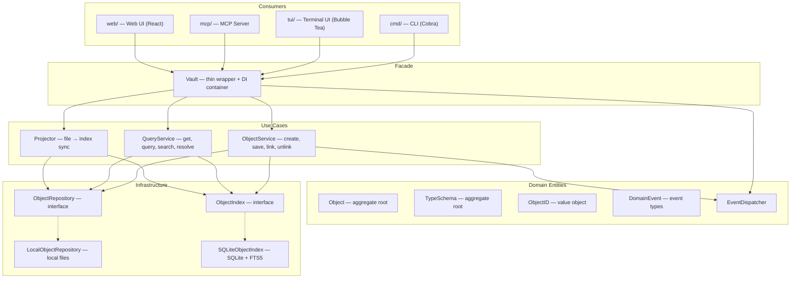
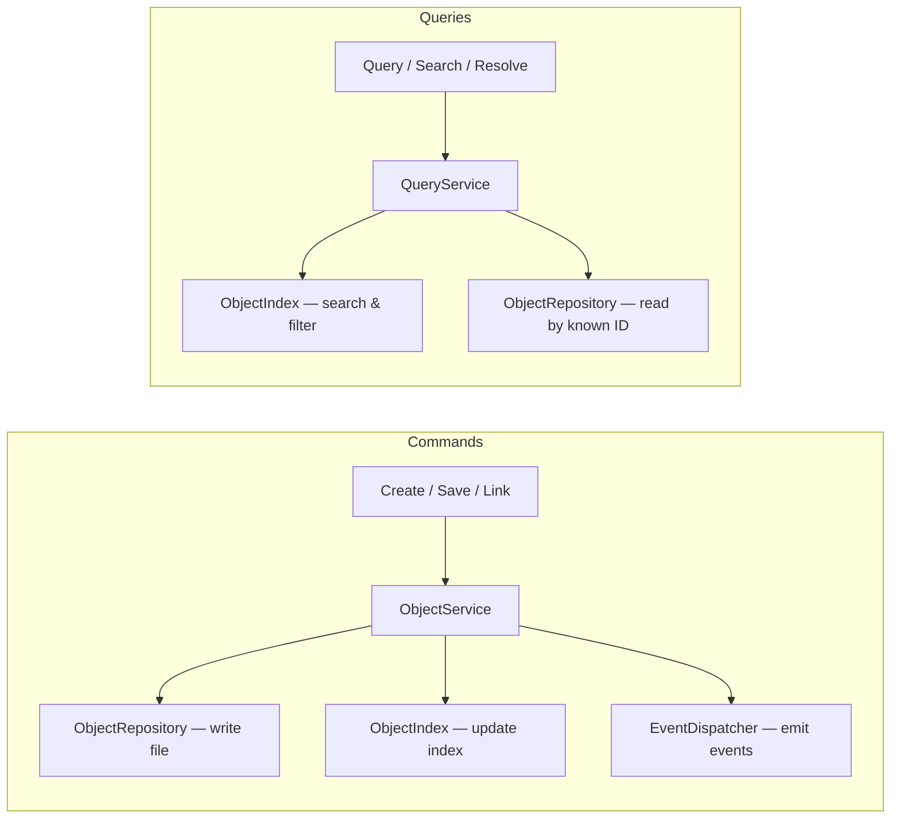

TypeMD's `core/` package follows **Clean Architecture** with **CQRS** (Command Query Responsibility Segregation). This page explains the internal design for contributors and plugin developers.

## Layers

The codebase is organized into four layers with strict dependency rules — outer layers depend on inner layers, never the reverse.



### Vault (Facade)

`Vault` is a thin facade and dependency injection container. It holds references to all services and exposes convenience methods that delegate to them. Consumers interact with `Vault` — they don't need to know about the internal services.

```go
vault.Objects   // ObjectService (commands)
vault.Queries   // QueryService (queries)
vault.Events    // EventDispatcher (subscribe to changes)
```

### Use Case Layer

**ObjectService** handles all write operations: creating objects, saving changes, setting properties, linking/unlinking relations. It coordinates domain entities with repositories and the index, and dispatches domain events after successful operations.

**QueryService** handles all read operations: getting objects by ID, resolving abbreviated IDs, querying by filter, full-text search, listing relations and backlinks, and building display properties.

**Projector** synchronizes the file-based source of truth into the search index. It walks all object files via the repository, applies migrations, and upserts entries into the index.

### Domain Entities

Domain entities carry both data and behavior. They are the core of the system and have no dependencies on infrastructure.

- **Object** — the aggregate root. Has methods like `Validate()`, `SetProperty()`, `LinkTo()`, `Unlink()`, `ApplyTemplate()`, and `MarkUpdated()`. Entity methods return `DomainEvent` values to signal what happened.
- **TypeSchema** — defines the structure of a type. Has `FindProperty()`, `FindRelation()`, `Validate()`.
- **ObjectID** — a value object representing `type/filename`. Provides `DisplayName()`, `DisplayID()`, `Slug()`.
- **DomainEvent** — marker interface for all [domain events](/developers/domain-events/).

### Infrastructure

Infrastructure implements the repository and index interfaces. The domain and use case layers depend only on the interfaces, never on concrete implementations.

- **ObjectRepository** — interface for entity persistence. Returns domain entities (`*Object`, `*TypeSchema`), not raw bytes. `LocalObjectRepository` implements it using the local filesystem.
- **ObjectIndex** — interface for search and discovery. Returns lightweight `ObjectResult` projections. `SQLiteObjectIndex` implements it using SQLite with FTS5.

## CQRS Pattern

Commands and queries follow separate paths through the system:



**Command path**: ObjectService writes to both the file (source of truth) and the index (acceleration layer). After success, it dispatches domain events.

**Query path**: QueryService reads from the index for search/filter operations, and from the repository when a full entity is needed by known ID.

**Projection**: The Projector reconciles the two stores by walking all files and upserting into the index. This runs on every vault open.

## Domain Events

Entity methods return domain events to signal what happened; the use case layer dispatches them after successful operations. Consumers subscribe via `vault.Events.Subscribe()`.

See [Domain Events](/developers/domain-events/) for the full event reference.

## Multi-Platform Support

The interface-based design enables multiple storage backends:

| Platform | ObjectRepository | ObjectIndex |
|----------|-----------------|-------------|
| CLI / TUI / Web UI | `LocalObjectRepository` (local files) | `SQLiteObjectIndex` (SQLite) |
| try.typemd.io | `GitHubObjectRepository` (GitHub API) | `InMemoryObjectIndex` |
| Desktop (Wails) | `LocalObjectRepository` | `SQLiteObjectIndex` |

Files are always the source of truth. The index is an optional acceleration layer that can be rebuilt from files at any time. For details on the indexing mechanism, see [Data Model](/developers/data-model).
