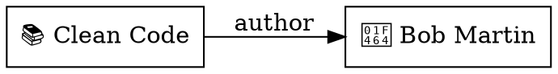

將 vault 的物件關係圖以 [DOT 格式](https://graphviz.org/doc/info/lang.html)匯出。節點代表物件，邊代表 relation 和 wiki-link。輸出至 stdout，可接管到 Graphviz 或其他視覺化工具。

## 基本用法

```bash
tmd graph
```

輸出包含所有物件為節點、所有 relation 和 wiki-link 為邊的 DOT 有向圖。

### 輸出範例



### 用 Graphviz 產生圖片

```bash
tmd graph | dot -Tpng -o graph.png
tmd graph | dot -Tsvg -o graph.svg
```

## 依 type 篩選

```bash
tmd graph --type book
tmd graph --type book --type person
```

只包含指定 type 的物件。只有當邊的兩端都在篩選集合中時才會出現邊。`--type` 可以重複使用。

## 控制邊的類型

```bash
tmd graph --no-wikilinks    # 只顯示 relation
tmd graph --no-relations    # 只顯示 wiki-link
tmd graph --no-relations --no-wikilinks  # 只顯示節點
```

Relation 邊以實線繪製，標籤為屬性名稱。Wiki-link 邊以虛線繪製，標籤為 "wikilink"。

## 邊的行為

- **Relations**：從來源到目標的有向邊，標籤為 relation 屬性名稱。雙向 relation 每個儲存方向各產生一條邊（例如 `author` 和 `books`）。
- **Wiki-links**：從連結物件到目標的虛線有向邊。未解析的 wiki-link（目標不存在）會被跳過。
- **去重**：相同來源、目標和標籤的邊會被去重。
