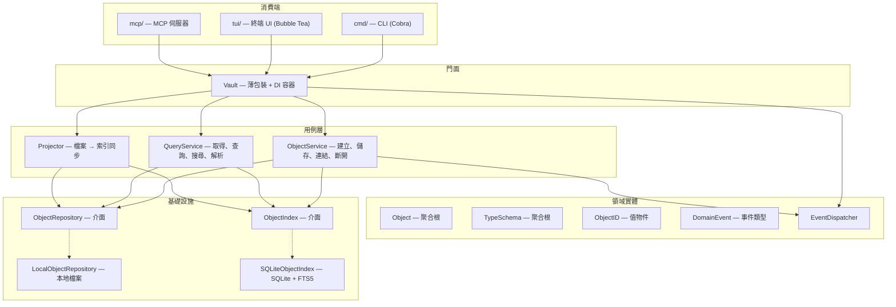
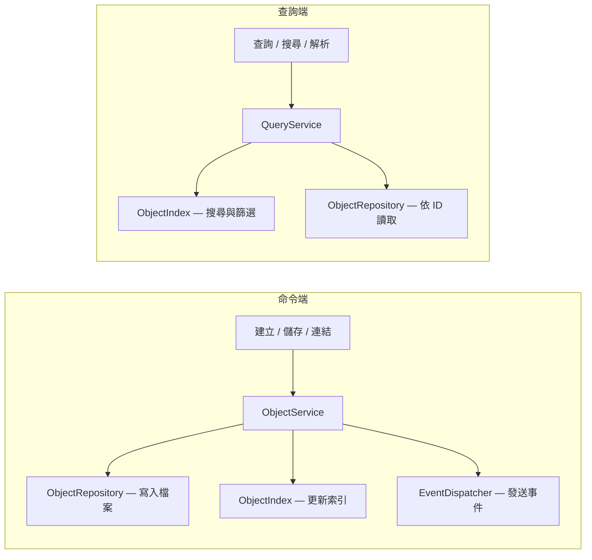

TypeMD 的 `core/` 套件遵循 **Clean Architecture** 搭配 **CQRS**（Command Query Responsibility Segregation）模式。本頁說明內部設計，適合貢獻者和插件開發者參考。

## 分層架構

程式碼分為四個層次，遵守嚴格的依賴規則 — 外層依賴內層，反過來不行。



### Vault（門面）

`Vault` 是一個薄門面和依賴注入容器。它持有所有服務的參考，並暴露便利方法來委派。消費端與 `Vault` 互動 — 不需要知道內部服務的細節。

```go
vault.Objects   // ObjectService（命令操作）
vault.Queries   // QueryService（查詢操作）
vault.Events    // EventDispatcher（訂閱變更）
```

### 用例層

**ObjectService** 處理所有寫入操作：建立物件、儲存變更、設定屬性、連結 / 斷開關聯。它協調領域實體與 Repository 和 Index，並在操作成功後派發領域事件。

**QueryService** 處理所有讀取操作：依 ID 取得物件、解析縮寫 ID、依條件篩選、全文搜尋、列出關聯和反向連結、組裝顯示屬性。

**Projector** 將檔案來源（source of truth）同步到搜尋索引。它透過 Repository 走訪所有物件檔案，套用遷移，並 upsert 到索引中。

### 領域實體

領域實體同時承載資料和行為。它們是系統的核心，不依賴基礎設施。

- **Object** — 聚合根。擁有 `Validate()`、`SetProperty()`、`LinkTo()`、`Unlink()`、`ApplyTemplate()`、`MarkUpdated()` 等方法。實體方法回傳 `DomainEvent` 來表達發生了什麼。
- **TypeSchema** — 定義型別的結構。擁有 `FindProperty()`、`FindRelation()`、`Validate()`。
- **ObjectID** — 值物件，代表 `type/filename`。提供 `DisplayName()`、`DisplayID()`、`Slug()`。
- **DomainEvent** — 事件的標記介面，如 `ObjectCreated`、`PropertyChanged`、`ObjectLinked`。

### 基礎設施

基礎設施實作 Repository 和 Index 介面。領域和用例層只依賴介面，永不依賴具體實作。

- **ObjectRepository** — 實體持久化介面。回傳領域實體（`*Object`、`*TypeSchema`），不是原始位元組。`LocalObjectRepository` 使用本地檔案系統實作。
- **ObjectIndex** — 搜尋和探索介面。回傳輕量的 `ObjectResult` 投影。`SQLiteObjectIndex` 使用 SQLite + FTS5 實作。

## CQRS 模式

命令和查詢走不同的路徑：



**命令路徑**：ObjectService 同時寫入檔案（source of truth）和索引（加速層）。成功後派發領域事件。

**查詢路徑**：QueryService 從索引讀取搜尋 / 篩選結果，需要完整實體時從 Repository 以 ID 讀取。

**投影**：Projector 透過走訪所有檔案並 upsert 到索引來調和兩個儲存。這在 vault 開啟時（如果索引為空）和 `tmd reindex` 時執行。

## 領域事件

實體方法回傳領域事件來表達發生了什麼：

```go
event, err := obj.SetProperty("title", "New Title", schema)
// event 是 PropertyChanged{ObjectID: "book/x", Key: "title", Old: "Old", New: "New Title"}
```

用例層收集事件並在操作成功後派發：

```go
vault.Events.Subscribe(func(e core.DomainEvent) {
    switch e := e.(type) {
    case core.ObjectCreated:
        // 處理新物件
    case core.PropertyChanged:
        // 處理屬性更新
    }
})
```

可用的事件類型：`ObjectCreated`、`ObjectSaved`、`PropertyChanged`、`ObjectLinked`、`ObjectUnlinked`、`TagAutoCreated`。

## 多平台支援

基於介面的設計支援多種儲存後端：

| 平台 | ObjectRepository | ObjectIndex |
|------|-----------------|-------------|
| CLI / TUI | `LocalObjectRepository`（本地檔案）| `SQLiteObjectIndex`（SQLite）|
| try.typemd.io | `GitHubObjectRepository`（GitHub API）| `InMemoryObjectIndex` |
| 桌面應用（Wails）| `LocalObjectRepository` | `SQLiteObjectIndex` |

檔案永遠是 source of truth。索引是可選的加速層，可以隨時從檔案重建。
